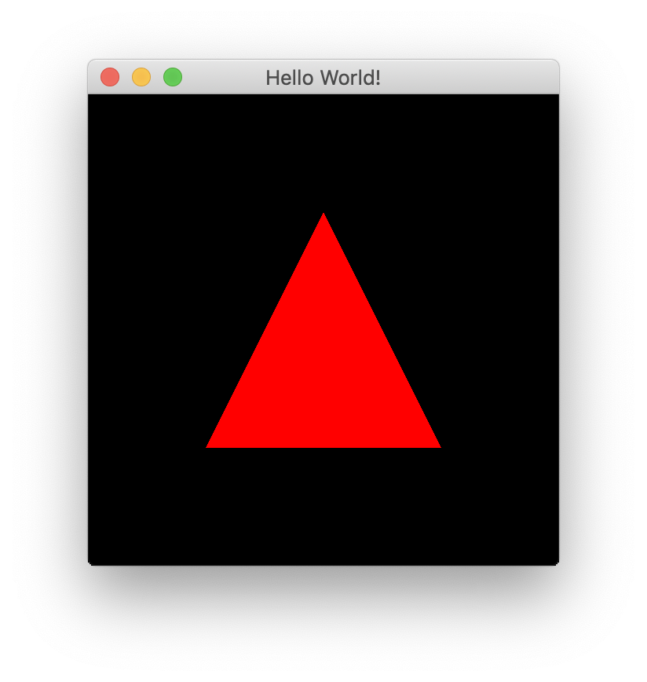
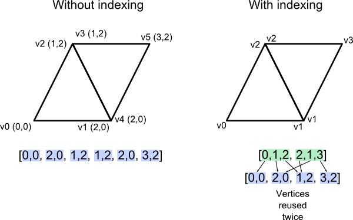
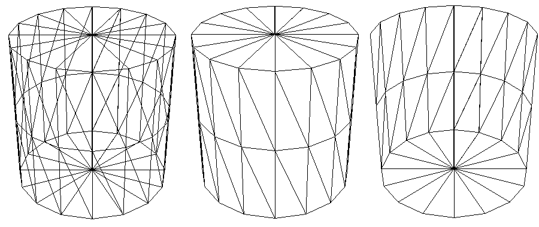
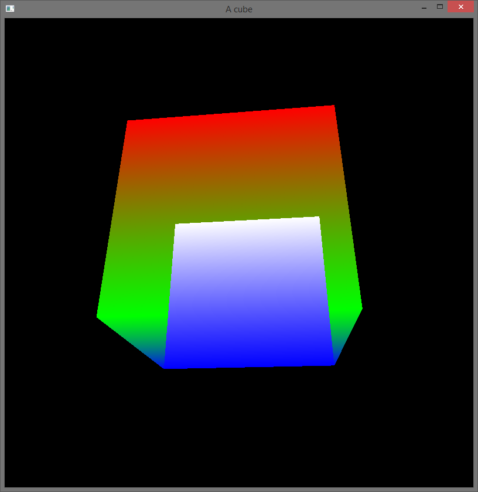

# 3D Graphics Rendering with OpenGL
## Jerred Shepherd

Note:
 Brief introduction about me

---

# Introduction

1. Background
2. Core concepts
3. Brief introduction to OpenGL
4. Using OpenGL
5. Brief demo

---

# What is Graphics Rendering?

Note: 

* The process of creating an image from a 2D or 3D scene
* We see it in action every day on our phones, laptops, and every Friday on this projector

---

# What is Graphics Rendering?


---

# Where is Graphics Rendering Used?
* Bootloaders
* Operating systems
* Video games
* Computer animation

Note:

* Graphics rendering is used in very low-level places like text tendering for a bootloader, and high-level places like videos game and desktop applications

---

# Why Learn Graphics Rendering?
* Gain a better understanding of computers
* Write better applications
* Implement your own graphics rendering if needed
* Exposure to GPU programming

Note:

* Computer graphics is something that we use every day, but most of us probably don't know much about it
* Most of us won't write graphical programs running at such a low level, but it is useful to understand how things work

---

# Background
* Graphics rendering requires a lot of computation
* This computation can be done in parallel
* CPUs aren't well suited
* GPUs were created to supplement CPUs

---

# GPU Programming
* Interacting with GPUs requires the use of a graphics API

Note:

* Programming a CPU involves writing code, compiling it, and then executing a binary
* Using a GPU is different
* Instead of directly writing code, you use a API to communicate with the GPU
* You can also write programs that execute on the GPU, but you still need to use APIs to load and execute the program
* APIs exist for graphics programming, and for general computation
* GPUs having become very popular for compute-heavy tasks, such as AI and data processing

---

# Popular Graphics APIs
* OpenGL
* DirectX
* Vulkan
* Metal

Note:

* Many graphics APIs exist
* Which one you can use depends on your operating system and graphics card
* OpenGL is a popular cross-platform API, and is supported on all modern consumer graphics cards

---

# Core Concepts of Graphics Rendering

Note:

* Before we dig into OpenGL, it's important to understand some core concepts of computer graphics
* These concepts will transfer over to any graphics API

---

# Common Primitives
* Points
* Lines
* Triangles

Note:

* Primitives are defined as vectors with a length of four
* They contain x, y, z, and w elements
* These are the three most important primivites in graphics rendering

---

# Common Primitives


Note:

* With these primitives, you can draw anything you want
* https://fgiesen.wordpress.com/2011/07/01/a-trip-through-the-graphics-pipeline-2011-part-1/

---

# Matrices

* OpenGL uses matrices to transform primitives

Note:

* OpenGL uses matrices to transform the vector we define primitives with
* There are several common matrices used -- we will cover model and projection matrices

---

# Projection Matrix
* Project objects onto the screen

Note:

* Projection matrices define how our primitives are projected on the screen from a 3D space to a 2D space

---

# Model Matrix
* Translate
* Rotate
* Scale

Note:

* Model matrices modify positions of primitives
* Model matrices allow us to translate, rotate, and scale primitives

---

# Introduction to OpenGL

Note:

* Now we'll be apply these concepts with OpenGL

---

# Introduction to OpenGL

* Both a specification and an API

Note:

* OpenGL is both a specification and a graphics API
* The specification is defined by the Khronos Group
* The API is implemented by the hardware manufacturer

---

# Where does OpenGL work?

* Most programming languages
* All major operating systems
* All major windowing systems

Note:

* OpenGL is callable from most programming languages
* OpenGL works one every major operating system, and with every major windowing system

---

# Using OpenGL

---

# Java and OpenGL

* lwjgl: Lightweight Java Game Library
* JOGL: Java OpenGL

Note:

* Java has great support for OpenGL through a library called the Lightweight Java Game Library (lwjgl)
* Java and OpenGL is a great combination because it allows you to easily create cross-platform graphical applications
* lwjgl has support for many other native libraries, some of which which we will use
* We will begin with creating a blank window on our desktop
* This isn't particularly impressive, but it is a good place to start

---

# Creating a Window
* GLFW: Graphics Library Framework

Note:

* GLFW, or Graphics Library Framework, is a cross-platform library for creating windows and handling window events such as input
* GLFW will create our window for us, and something called an OpenGL context
* All of our drawing will occur within this OpenGL context
* OpenGL context: stores OpenGL state. All OpenGL commands will effect the current context.

---

# Creating a Window with GLFW

```java
// Initialize GLFW
// Checks what features the machine has, finds input methods, performs platform-specific initialization
glfwInit();

// Create a new window with a given width, height, and title.

long window = glfwCreateWindow(300, 300, "Hello World!", NULL, NULL);

// Set the newly created window at the current OpenGL context
glfwMakeContextCurrent(window);

// Show the window
glfwShowWindow(window);

// Loads the native OpenGL library and creates OpenGL bindings
GL.createCapabilities();
```

Note:

* glfwCreateWindow: First NULL parameter is the fullscreen monitor to use, second NULL parameter is the window to share resources with (VBOs, textures, etc.) 

---

# VAOs and VBOs
* VAO: Vertex Array Object
  * Stores all of the information to render an object
* VBO: Vertex Buffer Object

Note:

* OpenGL stores vertices in vertex buffer objects
* These buffers are then bound to vertex array objects
* A VAO is then bound and drawn by OpenGL

---

# Creating a VBO

```java
// Create a VBO and store its name
glVboName = glGenBuffers();

// Bind the VBO created in the last step
glBindBuffer(GL_ARRAY_BUFFER, glVboName);
```

Note:

* This is a very common pattern -- creating a name and binding it

---

# Sending Data to a VBO

```java
float[] vertices = new float[]{
    0.0f, 0.5f, 0.0f,
    -0.5f, -0.5f, 0.0f,
    0.5f, -0.5f, 0.0f
};

try (var stack = MemoryStack.stackPush()) {
  // Allocate a native buffer to store the vertices
  var vertexBuffer = stack.mallocFloat(vertices.length);

  // Put the previously declared vertices into the float buffer
  vertexBuffer.put(vertices);
  vertexBuffer.flip();

  // Send the vertices to the graphics hardware
  glBufferData(GL_ARRAY_BUFFER, vertexBuffer, GL_STATIC_DRAW);
}
```

---

# Creating a VAO

```java
// Create a VAO and store its name
glVaoName = glGenVertexArrays();

// Bind the VAO that was just created
glBindVertexArray(glVaoName);
```

---

# Binding a VBO to a VAO

```java
// Bind the previously created VBO
glBindBuffer(GL_ARRAY_BUFFER, glVboName);

// Have the first VAO index point to the bound VBO
glVertexAttribPointer(0, 3, GL_FLOAT, false, 0, 0);

// Enable the first VAO index
glEnableVertexAttribArray(0);
```

---

# Binding a VBO to a VAO


---

# Drawing a VAO

```java
glDrawArrays(GL_TRIANGLES, 0, 3);
```

---

# The Rendering Pipeline


---

# Shaders

* Small programs that run on the GPU
* Allows the user to modify how OpenGL uses data it receives

---

# Vertex Shader

```c
#version 330 core

// A vector of 3 floats at index 0 of the VAO
layout (location = 0) in vec3 position;

// A vector of 4 floats at index 1 of the VAO
layout (location = 1) in vec4 inColor;

// Output a vector of 4 floats
out vec4 color;

void main() {
    // Transform the position of the vertex by the projection matrix
    gl_Position = vec4(position, 1.0);

    // Pass the color to the fragment shader
    color = inColor;
}
```

---

# Fragment Shader
```c
#version 330 core

// A vector of 4 floats in
in vec4 color;

// A vector of 4 floats out
out vec4 outColor;

void main() {
    // Set the outgoing color to the incoming color
    outColor = color;
}

```

---

# Our First Triangle



---

# Uniforms
* Global variable that does not change during a render call
* Perfect for storing matrices

---

# Setting a Uniform

```java
var matrix = new Matrix4f();

glUniformName = glGetUniformLocation(glShaderProgramName, name);

try (MemoryStack stack = MemoryStack.stackPush()) {
  FloatBuffer fb = stack.mallocFloat(16);
  matrix.get(fb);
  glUniformMatrix4fv(glUniformName, false, fb);
}
```

---

# Using a Uniform

```c
uniform mat4 projectionMatrix;
uniform mat4 modelMatrix;

void main() {
    gl_Position = projectionMatrix * modelMatrix * vec4(inPosition, 1.0);
    outputs.color = inColor;
}
```

---

# Indexed Rendering



---

# Code Without Indexing

```java
float[] vertices = new float[]{
    // Format: x, y, z
    // Triangle one
    0.0f, 0.0f, 0.0f, // Top left
    0.0f, -1f, 0.0f,  // Bottom left
    1f, 0.0f, 0.0f,   // Top right
    // Triangle two
    0.0f, -1f, 0.0f,  // Bottom left
    -1f, -1f, 0.0f,   // Bottom right
    0.0f, -1f, 0.0f   // Top right
};
```

---

# Code With Indexing

```java
float[] vertices = new float[]{
    0.0f, 0.0f, 0.0f, // Top left
    0.0f, -1f, 0.0f,  // Bottom left
    1f, 0.0f, 0.0f,   // Top right
    -1f, -1f, 0.0f,   // Bottom right
};

int[] indices = new int[] {
    0, 1, 2, // Triangle One
    0, 2, 3  // Triangle Two
};
```

---

# Textures

```java
// Create and bind a texture
glTextureName = glGenTextures();
glBindTexture(GL_TEXTURE_2D, glTextureName);

// Load a texture into the bound texture buffer
glTexImage2D(GL_TEXTURE_2D,
    0,
    GL_RGBA,
    width,
    height,
    0,
    GL_RGBA,
    GL_UNSIGNED_BYTE,
    imageData);
```

---

# Texture Fragment Shader

```c
#version 330 core

vec2 textureCoord;

out vec4 outColor;

// Uses the bound texture
uniform sampler2D textureSampler;

void main() {
    outColor = texture(textureSampler, textureCoord);
}
```

---

# Demo Application

---

# Conclusion

---

# References

---

# Appendix: Clipping


Note:

https://paroj.github.io/gltut/Positioning/Tut05%20Boundaries%20and%20Clipping.html

---

# Appendix: Culling



Note:

http://glasnost.itcarlow.ie/~powerk/technology/opengl/hsr_culling.html

---

# Appendix: Depth Testing




Note:

https://stackoverflow.com/questions/30310024/opengl-depth-test-doesnt-work

---

# Appendix: Projection Matrix

$$
  \begin{bmatrix}
    \dfrac{\dfrac{1}{tan(\dfrac{\mathit{fov}}{2})}}{a} &
    0 &
    0 &
    0 \\ \\
    0 &
    \dfrac{1}{tan(\dfrac{\mathit{fov}}{2})} &
    0 &
    0 \\ \\
    0 &
    0 &
    \dfrac{-(z_f + z_n)}{z_f - z_n} &
    \dfrac{-(2 * z_f * z_n)}{z_f - z_n} \\ \\
    0 &
    0 &
    -1 &
    0
  \end{bmatrix}
$$

Note:
 fov is the of field, or the angle of the area that is visible
Note:
 z near is the closest visible z coordinate
Note:
 z far is the furthest visible z coordinate

---

# Appendix: Projection Matrix


---

# Appendix: Coordinate Spaces


Note:

https://learnopengl.com/Getting-started/Coordinate-Systems

---

# Appendix: w coordinate

---

# Appendix: OpenGL Language Bindings
* Ada
* C
* Common LISP
* C#
* C++
* Delphi
* Fortran
* Haskell
* Java
* Lua
* OCaml
* Perl
* Python
* Ruby
* Visual Basic

Note:

https://www.khronos.org/opengl/wiki/Language_bindings

---

# Appendix: Texture Filtering


Note:

https://learnopengl.com/Getting-started/Textures

---

# Appendix: Texture wrapping


Note:

https://learnopengl.com/Getting-started/Textures

---

# Appendix: Mipmaps


Note:

https://learnopengl.com/Getting-started/Textures

---

# Appendix: Pipeline Visualization

