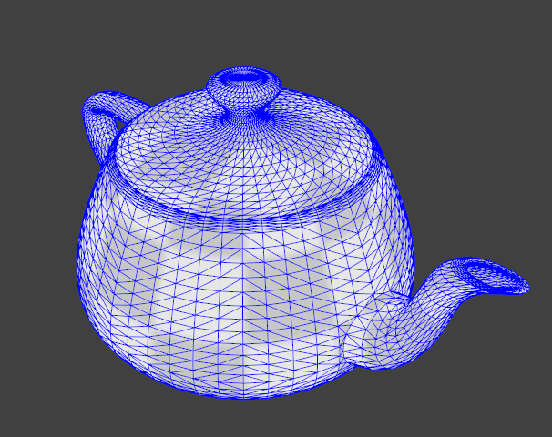
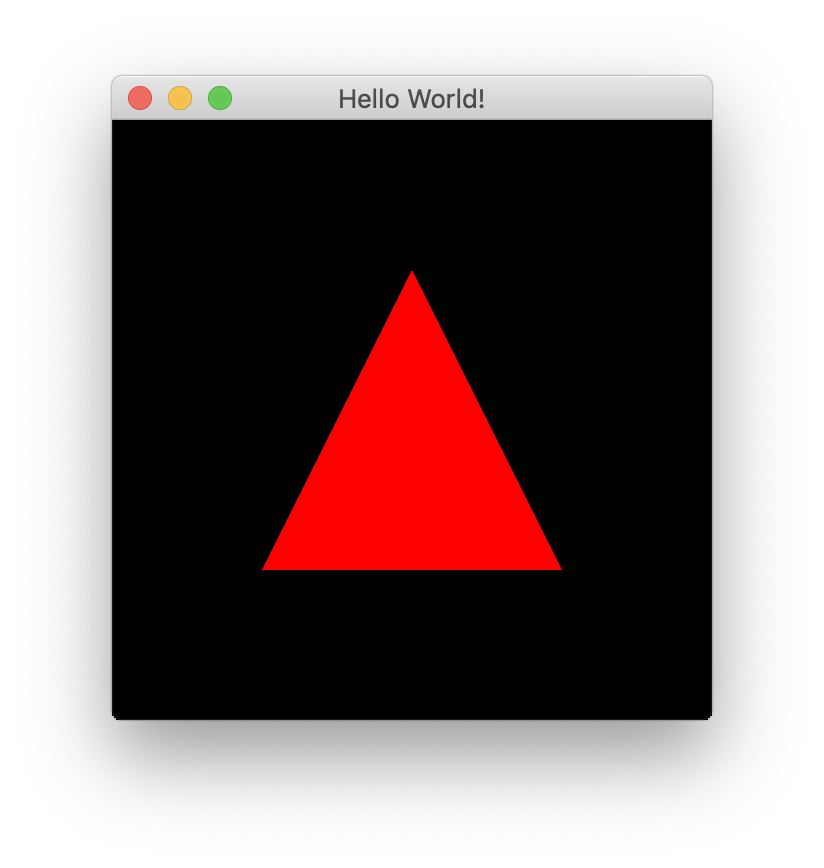
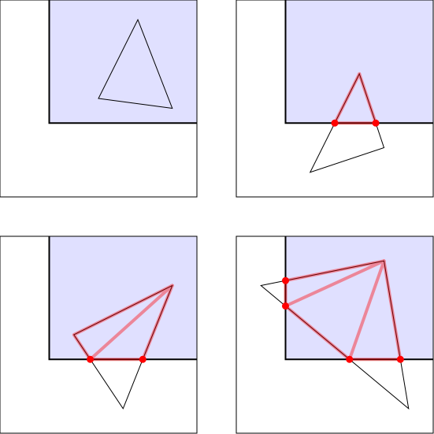
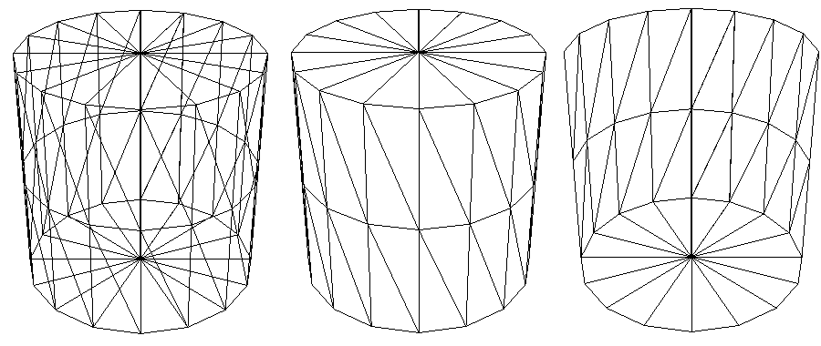
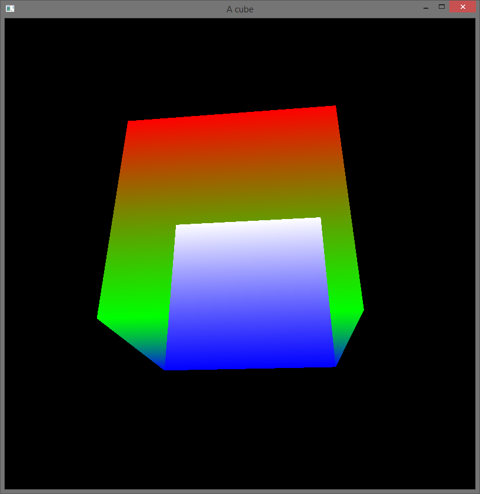
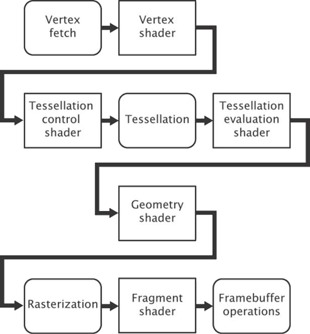

slidenumbers: true

# 3D Graphics Rendering with OpenGL
## Jerred Shepherd

^ Brief introduction about me

---
[.autoscale: true]

# Contents

1. Background of computer graphics 
2. Core computer graphics concepts
3. Introduction to OpenGL
4. How to use OpenGL
5. Brief demo

---

# Introduction to computer graphics

^ Computer graphics is something that all of us use every day, but most of us probably don't know much about it
^ Most of us won't write graphical programs running at such a low level, but it is cool to understand how things work


---

# What is graphics rendering?

^ Displays can be though of as a 2D matrix of pixels
^ Graphics rendering is how computers convey meaning on displays

---

# Where is graphics rendering used?
* Bootloaders
* Operating systems
* Video games
* Computer animation

^ Here are a few areas where graphics rendering is applied
^ Graphics rendering is used in very low-level places like text tendering for a bootloader, and high-level places like videos game and desktop applications

---

# Background

^ Why is graphics rendering special? What makes it its own field of CS?

---

# Graphics rendering requires a lot of computation
## :(

^ Graphics rendering involves positioning primitives in a 3D space and then drawing them on the screen
^ This requires a lot of math, which means our processors have a lot of calculation to do

---

# This computation can be done in parallel
## :)

^ It turns out that these calculations can be done easily in parallel

---

# CPUs are slow
## :(

^ Unfortunately CPUs are not fast enough
^ They are great for general computation, but aren't suited towards the task of computer graphics
^ They have too few cores and context switching is too slow

---

# GPUs are fast
## :)

^ GPUs were created as a coprocessor
^ They excel at floating-point operations, which is used heavily in computer graphics

---

# Programming a GPU

^ Programming a CPU involves writing code, compiling it, and then executing a binary
^ Using a GPU is different
^ Instead of directly writing code, you use a API to communicate with the GPU
^ You can also write programs that execute on the GPU, but you still need to use APIs to load and execute the program
^ APIs exist for graphics programming, and for general computation
^ GPUs having become very popular for compute-heavy tasks, such as AI and data processing

---

# Graphics APIs
* OpenGL
* DirectX
* Vulkan
* Metal

^ Many graphics APIs exist
^ Which one you can use depends on your operating system and graphics card
^ OpenGL is a popular cross-platform API, and is supported on all modern consumer graphics cards

---

# Crash Course in Computer Graphics

^ Before we dig into OpenGL, it's important to understand some core concepts of computer graphics
^ These concepts will transfer over to any graphics API

---

# Primitives
* Points
* Lines
* Triangles

^ Primitives are defined as vectors with a length of four
^ They contain x, y, z, and w elements
^ These are the three most important primivites in graphics rendering
^ With these primitives, you can draw anything you want

---

# Drawing a Complex Object



[^1]: Image from https://fgiesen.wordpress.com/2011/07/01/a-trip-through-the-graphics-pipeline-2011-part-1/

---

# Matrices

^ OpenGL uses matrices to transform the vector we define primitives with
^ There are several common matrices used -- we will cover model and projection matrices

---

# Projection Matrix

^ Projection matrices define how our primitives are projected on the screen from a 3D space to a 2D space

---

# Model Matrix

^ Model matrices modify positions of primitives
^ Model matrices allow us to translate, rotate, and scale primitives

---

# Introduction to OpenGL

^ OpenGL is both a specification and a graphics API
^ The specification is defined by the Khronos Group
^ The API is implemented by the hardware manufacturer

---

# Where does OpenGL work?

^ OpenGL is callable from most programming languages
^ OpenGL works one every major operating system, and with every major windowing system

---

# Java and OpenGL

^ Java has great support for OpenGL through a library called the Light-Weight Java Game Library (lwjgl)
^ Java and OpenGL is a great combination because it allows you to easily create cross-platform graphical applications
^ lwjgl has support for many other native libraries, some of which which we will use

---

# Getting Started with lwjgl

* lwjgl: Lightweight Java Game Library

^ We will begin with creating a blank window on our desktop
^ This isn't particularly impressive, but it is a good place to start

---

# Creating a Window with GLFW

* GLFW: Graphics Library Framework

^ GLFW, or Graphics Library Framework, is a cross-platform library for creating windows and handling window events such as input
^ GLFW will create our window for us, and something called an OpenGL context
^ All of our drawing will occur within this OpenGL context

---

# Creating a Window with GLFW

```java
// Initialize GLFW
glfwInit();

// Create a new window with a given width, height, and title
long window = glfwCreateWindow(300, 300, "Hello World!", NULL, NULL);

// Set the newly created window at the current OpenGL context
glfwMakeContextCurrent(window);

// Show the window
glfwShowWindow(window);

// Creates OpenGL bindings using the current context
GL.createCapabilities();
```

---

# Preparing to Draw

^ Now we have a window where we can draw

---

# VAOs and VBOs

^ OpenGL stores vertices in vertex buffer objects
^ These buffers are then bound to vertex array objects
^ A VAO is then bound and drawn by OpenGL

---

# OpenGL API Patterns

---

# Creating a VBO

```java
// Create a VBO and store its name
glVboName = glGenBuffers();

// Bind the VBO created in the last step
glBindBuffer(GL_ARRAY_BUFFER, glVboName);
```

---

# Sending Data to a VBO

```java
float[] vertices = new float[]{
    0.0f, 0.5f, 0.0f,
    -0.5f, -0.5f, 0.0f,
    0.5f, -0.5f, 0.0f
};

try (var stack = MemoryStack.stackPush()) {
  // Allocate a native buffer to store the vertices
  var vertexBuffer = stack.mallocFloat(vertices.length);

  // Put the previously declared vertices into the float buffer
  vertexBuffer.put(vertices);
  vertexBuffer.flip();

  // Send the vertices to the graphics hardware
  glBufferData(GL_ARRAY_BUFFER, vertexBuffer, GL_STATIC_DRAW);
}
```

---

# Creating a VAO

```java
// Create a VAO and store its name
glVaoName = glGenVertexArrays();

// Bind the VAO that was just created
glBindVertexArray(glVaoName);
```

---

# Binding a VBO to a VAO

```java
// Bind the previously created VBO
glBindBuffer(GL_ARRAY_BUFFER, glVboName);

// Have the first VAO index point to the bound VBO
glVertexAttribPointer(0, 3, GL_FLOAT, false, 0, 0);

// Enable the first VAO index
glEnableVertexAttribArray(0);
```

---

# Drawing a VAO

```java
glDrawArrays(GL_TRIANGLES, 0, 3);
```

---

# The Rendering Pipeline

---

# Shaders

---

# Vertex Shader

```c
#version 330 core

// A vector of 3 floats at index 0 of the VAO
layout (location = 0) in vec3 position;

// A vector of 4 floats at index 1 of the VAO
layout (location = 1) in vec4 inColor;

// Output a vector of 4 floats
out vec4 color;

void main() {
    // Transform the position of the vertex by the projection matrix
    gl_Position = vec4(position, 1.0);

    // Pass the color to the fragment shader
    color = inColor;
}
```

---

# Fragment Shader
```c
#version 330 core

// A vector of 4 floats in
in vec4 color;

// A vector of 4 floats out
out vec4 outColor;

void main() {
    // Set the outgoing color to the incoming color
    outColor = color;
}

```

---

# Our First Triangle



---

# Uniforms

---

# Setting a Uniform

```java
glUniformName = glGetUniformLocation(glShaderProgramName, name);
try (MemoryStack stack = MemoryStack.stackPush()) {
  FloatBuffer fb = stack.mallocFloat(16);
  matrix.get(fb);
  glUniformMatrix4fv(glUniformName, false, fb);
}
```

---

# Using a Uniform

```c
uniform mat4 projectionMatrix;
uniform mat4 modelMatrix;

void main() {
    gl_Position = projectionMatrix * modelMatrix * vec4(inPosition, 1.0);
    outputs.color = inColor;
}
```

---

# Indexed Rendering

---

# Textures

---

# Drawing a Textured Cube

---

# Conclusion

---

# References
* 

---

# Appendix: Clipping



^ https://paroj.github.io/gltut/Positioning/Tut05%20Boundaries%20and%20Clipping.html

---

# Appendix: Culling



^ http://glasnost.itcarlow.ie/~powerk/technology/opengl/hsr_culling.html

---

# Appendix: Depth Testing




^ https://stackoverflow.com/questions/30310024/opengl-depth-test-doesnt-work

---

# Appendix: Projection Matrix

\[
  \begin{bmatrix}
    \dfrac{\dfrac{1}{tan(\dfrac{\mathit{fov}}{2})}}{a} &
    0 &
    0 &
    0 \\ \\
    0 &
    \dfrac{1}{tan(\dfrac{\mathit{fov}}{2})} &
    0 &
    0 \\ \\
    0 &
    0 &
    \dfrac{-(z_f + z_n)}{z_f - z_n} &
    \dfrac{-(2 * z_f * z_n)}{z_f - z_n} \\ \\
    0 &
    0 &
    -1 &
    0
  \end{bmatrix}
\]

^ fov is the of field, or the angle of the area that is visible
^ z near is the closest visible z coordinate
^ z far is the furthest visible z coordinate

---

# Appendix: Coordinate Spaces


^ https://learnopengl.com/Getting-started/Coordinate-Systems

---

# Appendix: w coordinate

---

[.autoscale: true]
# Appendix: OpenGL Language Bindings
* Ada
* C
* Common LISP
* C#
* C++
* Delphi
* Fortran
* Haskell
* Java
* Lua
* OCaml
* Perl
* Python
* Ruby
* Visual Basic

^ https://www.khronos.org/opengl/wiki/Language_bindings

---

# Appendix: Texture Filtering


^ https://learnopengl.com/Getting-started/Textures

---

# Appendix: Texture wrapping


^ https://learnopengl.com/Getting-started/Textures

---

# Appendix: Mipmaps


^ https://learnopengl.com/Getting-started/Textures

---

# Appendix: Other Shader Stages

